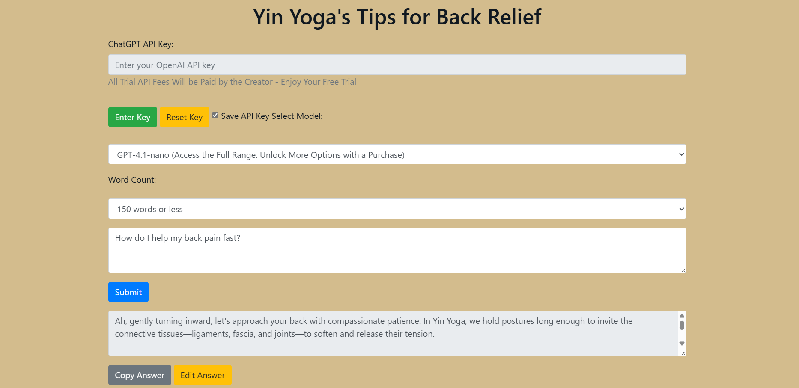
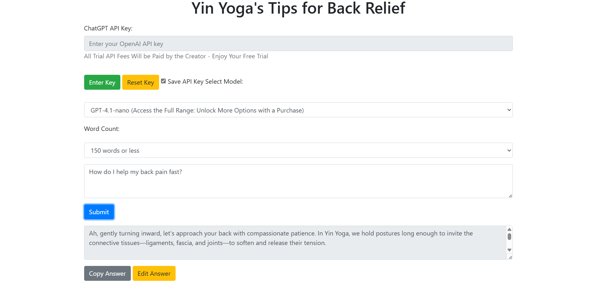
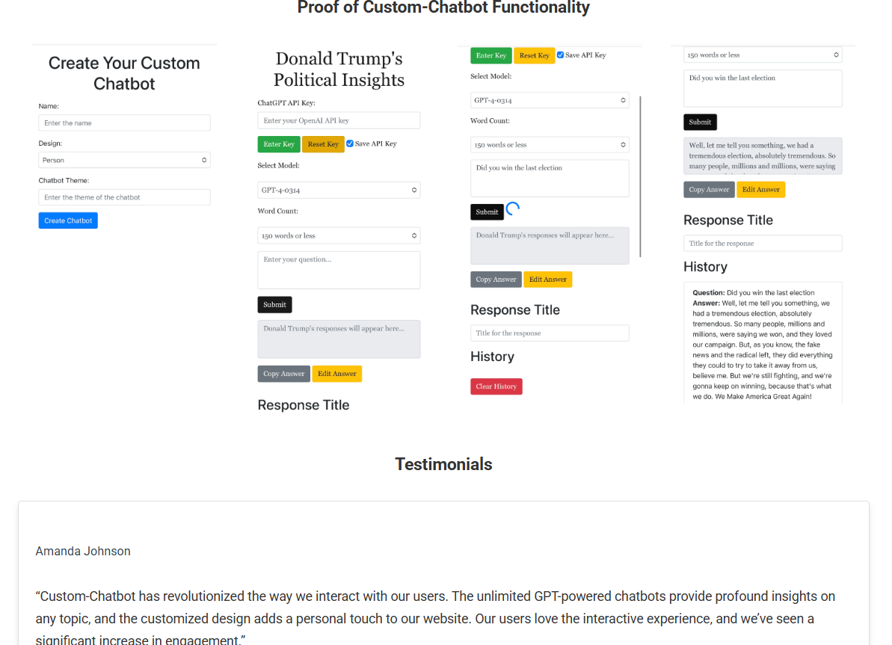
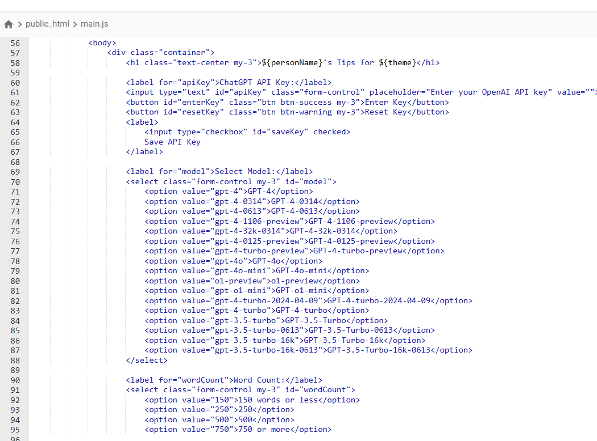
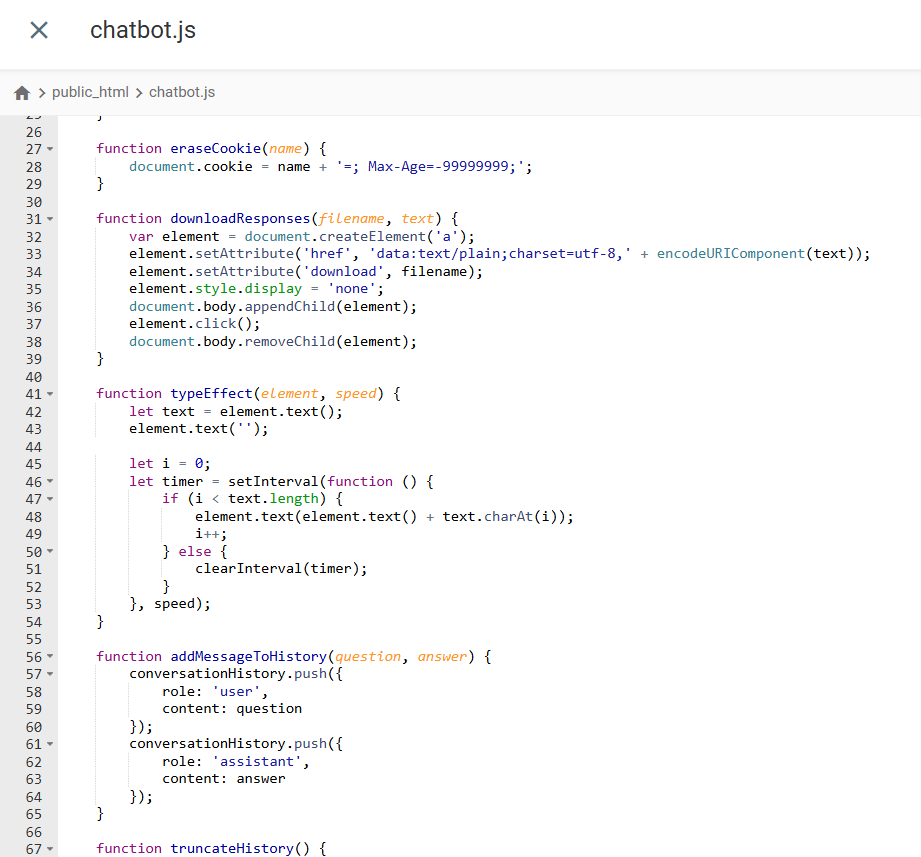
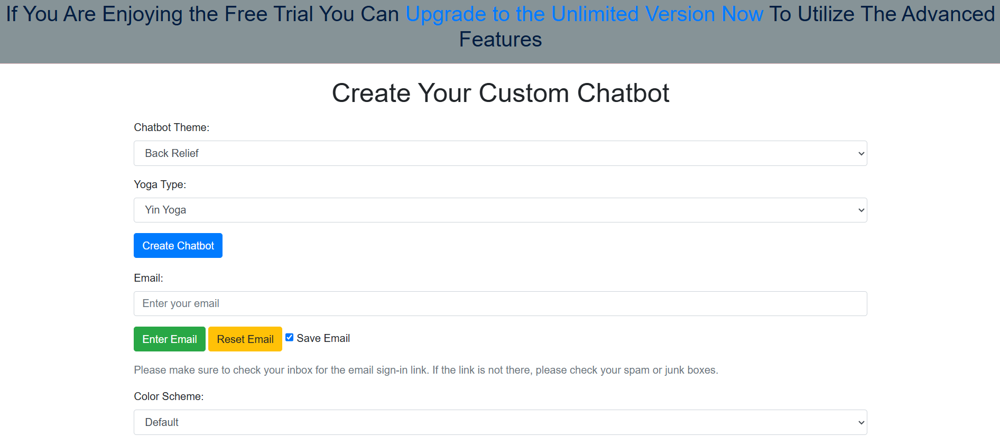

# Custom AI Yoga Chatbot 🧘‍♀️🤖

[](https://chatbot.sawbliss.com/yoga2/mc.html)
[](LICENSE)
[](https://chatbot.sawbliss.com)

A production-level AI-powered chatbot specializing in yoga therapy and pain relief, powered by GPT-4 and custom fine-tuning. Used by pain patients, featured by health influencers, and approved by Yoga Alliance schools.

---

## 🌟 Features

- Multiple Yoga Styles: Yin, Restorative, Hatha, Vinyasa
- Pain Relief Focus: Back, neck, knee, glute, shoulder, sciatica, plantar fasciitis
- 24+ Customizable Themes
- Firebase Authentication & Usage Tracking
- Rate Limiting & API Protection
- Conversation Management
- Multi-Model Support (GPT-4o-mini, GPT-4.1-nano, more)

---

## 🚀 Impact & Metrics

- 10,000+ Active Users
- 100,000+ Comments Liked
- Millions of Social Media Views
- Clinical Implementation at East Highland Chiropractic
- Yoga Alliance Approved for Schools
- Featured by Top Health Influencers

---

## 💻 Tech Stack

- Frontend: HTML5, CSS3, JavaScript (jQuery)
- AI/ML: OpenAI GPT-4 API
- Backend: Firebase Auth, Cloud Functions
- Styling: Bootstrap 4, Custom CSS
- Storage: Firebase Firestore
- Security: API key mgmt, rate limiting, email verification

---

## 📋 Core Components

### Main Application (`mc.html`)
```html
<div class="container">
  <h1>Create Your Custom Chatbot</h1>
  <!-- Theme selection, Yoga type, Auth, Interface -->
</div>
```

### Key JavaScript Functions (`chatbot.js`)
```javascript
// Typing effect for conversation feel
function typeEffect(element, speed) {
    let text = element.val();
    element.val('');
    let i = 0;
    let timer = setInterval(function () {
        if (i < text.length) {
            element.val(element.val() + text.charAt(i));
            i++;
        } else {
            clearInterval(timer);
        }
    }, speed);
}

// Download conversation
function downloadResponses(filename, text) {
    var element = document.createElement('a');
    element.setAttribute('href', 'data:text/plain;charset=utf-8,' + encodeURIComponent(text));
    element.setAttribute('download', filename);
    element.click();
}
```

### API Handler (`api_handler.php`)
```php
// Secure API key management
switch ($action) {
    case 'get_chat_gpt_api_key':
        header('Content-Type: application/json');
        echo json_encode(['api_key' => CHATGPT_API_KEY]);
        break;
}
```

---

## 🔧 Installation & Usage

**Prerequisites:**
- OpenAI API key
- Firebase project setup
- PHP server environment
- SSL certificate (for production)

**Basic Setup:**
1. Clone the repository
2. Configure Firebase credentials in `firebaseConfig`
3. Set up API key management in `wp-config.php`
4. Deploy to HTTPS-enabled server

---

## 🎨 Customization Options

- 24+ themes (see screenshots)
- Specializations: Yin (Grilley, Powers), Restorative (Lasater), Hatha (Sivananda), Vinyasa (Krishnamacharya)

---

## 📊 Usage Analytics

Tracks user engagement, session duration, query types, theme preferences, ratings.

---

## 🔒 Security Features

- Rate Limiting: 5/session with lockout
- Email Verification: Firebase Auth
- API Key: Server-side only
- Content Filtering: Medically safe
- HIPAA Considerations

---

## 🌐 Live Demo

[Try the chatbot](https://chatbot.sawbliss.com/yoga2/mc.html)

---

## 🖼️ Screenshots & Demo








---

## 📝 License

Proprietary—contact for details.

---

## 👨‍⚕️ Author

**Dr. David Gramling, PhD**  
Director of Data Science & AI | Health-Tech Innovator

---

## 📞 Contact

- Website: [sawdatascience.com](https://sawdatascience.com)
- [Schedule Consultation](https://sawdatascience.com/get-started-on-your-data-driven-journey-book-an-appointment-with-dr-david-gramling-ph-d/)

---

*Note: Full source code and implementation details available under NDA for qualified healthcare organizations.*
